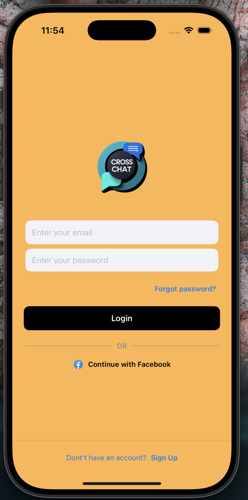
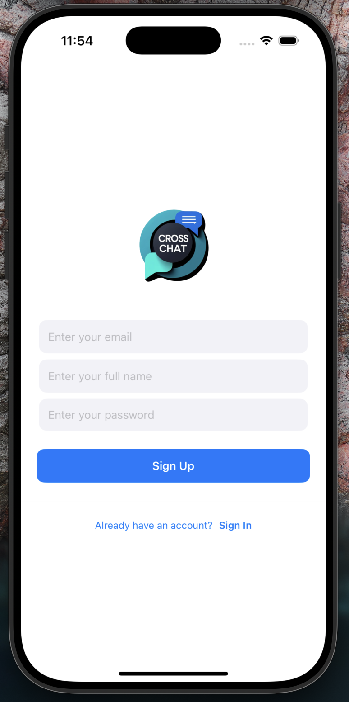
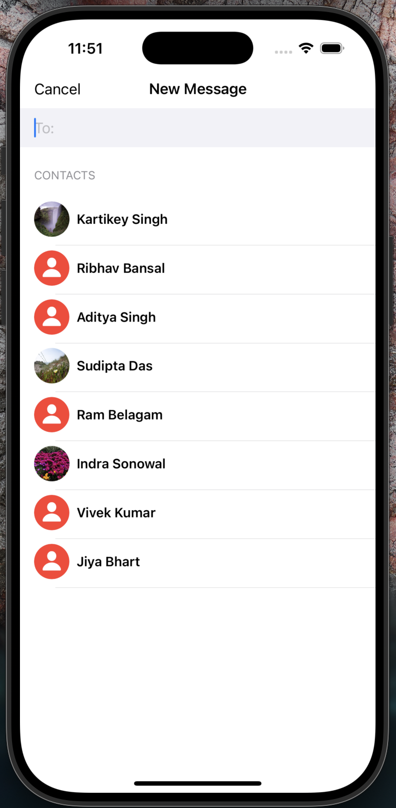
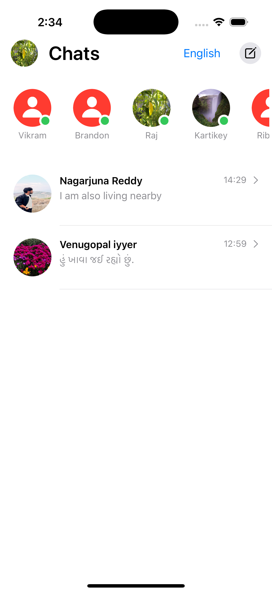
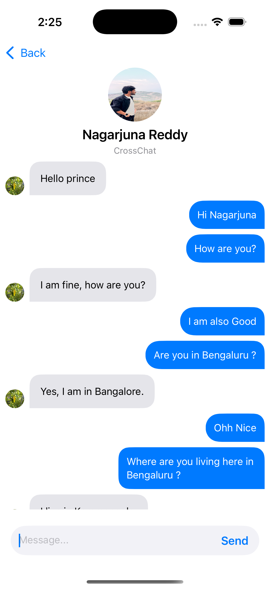
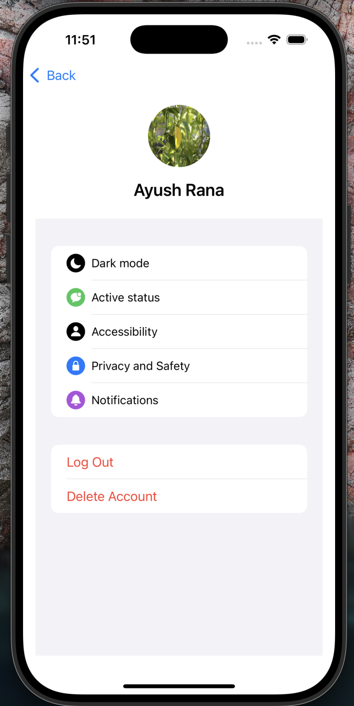

# 🌐 Cross-Language Chat Application

A full-stack **cross-language real-time chat application** that breaks language barriers by enabling seamless two-way translation. Each user can select a preferred language, and all messages are automatically translated both ways, allowing communication in each user's chosen language.

> 💡 **Future Scope**: Expanding this functionality to **real-time translated video calls**, enabling fully immersive multilingual communication.

---

## 🧠 Features

- 🔄 Two-Way Real-Time Translation
- 🌍 Multi-Language Support (Chat in your native language)
- ⚡ Instant Messaging Interface
- 🛠️ Full-Stack Architecture
- 🧑‍🤝‍🧑 Smooth User Experience for Multilingual Conversations
- 🗣️ Language Supported : English, Hindi, Maithili, Kannada, Awadhi, Bhojpuri, Gujarati, Marathi, Punjabi, Tamil, Telugu, Spanish, French, German, Italian, Russian, Chinese (Simplified), Japanese.

---

## 🚀 Tech Stack

- **Frontend**: Swift / SwiftUI
- **Backend**: Firebase
- **Database**: Firebase Firestore
- **Translation API**: Google Translate API

---

## 📸 Demo Screenshots

<table>
  <tr>
    <td style="padding: 10px;"> 
          <b>LoginView Screen</b> 
    </td>
    <td style="padding: 10px;"> 
          <b>SignupView Screen</b> 
    </td>
  </tr>
  <tr>
    <td style="padding: 10px;"> 
          <b>Select user to chat with</b> 
    </td>
    <td style="padding: 10px;"> 
          <b>First User InboxView Screen(Select preffered language)</b> 
    </td>
  <tr>
    <td style="padding: 10px;"> 
          <b>Second User InboxView Screen(Select preffered language)</b> 
    </td>
    <td style="padding: 10px;"> 
          <b>First User ChatView Screen</b> 
    </td>
  </tr>
  <tr>
    <td style="padding: 10px;"> 
          <b>Second User ChatView Screen</b> 
    </td>
    <td style="padding: 10px;"> 
          <b>ProfileView Screen</b> 
    </td>
 </tr>
</table>

